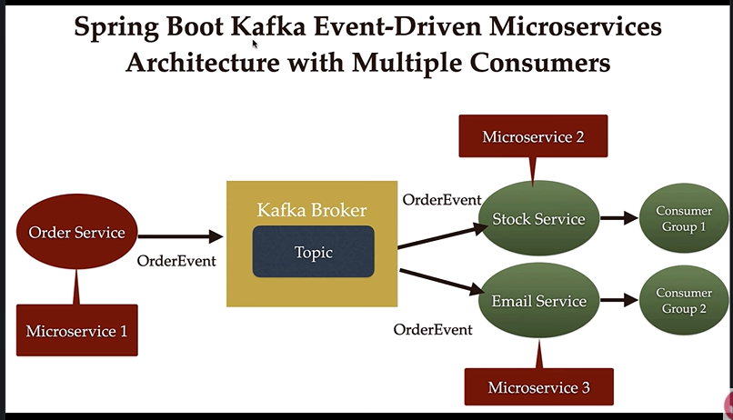

# 🧪 Kafka Beginner Project

Welcome to the Kafka Beginner Project! This repository provides a simple, beginner-friendly example of how Apache Kafka can be used for messaging between microservices.

---

## 📸 Architecture Overview



---

## 🧩 Project Structure

This project consists of **three services** that communicate using Kafka as the messaging backbone.

### 🔹 Service 1 (`Order service`)
- **Role**: Producer
- **Description**: Generates messages (events) and pushes them to a Kafka topic.

### 🔹 Service 2 (`Stocks service`)
- **Role**: Consumer
- **Description**: Listens to messages from Kafka and processes them.

### 🔹 Service 3 (`Email service`)
- **Role**: Consumer / Logger
- **Description**: Another consumer that logs or stores the messages for auditing or secondary processing.

---

## 🔄 Kafka Messaging Flow

1. `Order service` publishes messages to a Kafka topic.
2. `Stocks` and `Email` both subscribe to that topic.
3. Kafka ensures that each consumer gets a copy of the message (fan-out model).

---

## 🚀 Getting Started

### Prerequisites
- Docker & Docker Compose (or install Kafka & Zookeeper manually)
- Spring boot  / Java installed and set up

### 🛠️ To Run Using Docker
```bash
docker-compose up --build
```
# Kafka Best Practices Checklist  

---

## ⚙️ Setup & Infrastructure
- Latest stable Kafka version
- ≥ 3 brokers (odd number)
- Use partitions for scalability
- Replication factor ≥ 3
- KRaft mode if new cluster
- Fast SSDs; separate OS/log disks
- Monitor broker & disk health

## 🛡 Security
- Enable TLS/SSL encryption
- Use SASL/SCRAM for authentication
- Configure ACLs for topic access
- Secure schema registry & Connect

## 📦 Topic Design
- Clear naming (`orders.created`)
- Choose partition count wisely
- Set cleanup policy (delete vs compact)
- Avoid too many small topics

## 📝 Producer Best Practices
- Enable idempotence
- Use compression (lz4/zstd)
- Batch records (linger.ms, batch.size)
- Handle retries/timeouts
- Use keys to control partitioning

## 📥 Consumer Best Practices
- Use consumer groups
- Understand offset commit strategies
- Tune poll configs
- Handle rebalances
- Avoid slow consumers (prevent lag)

## 📡 Inter-service Design
- Prefer async/event-driven
- Version schemas & use registry
- Support backward/forward compatibility

## 📊 Monitoring & Observability
- Prometheus + Grafana
- Kafka UI tools (AKHQ, Conduktor)
- Distributed tracing (Jaeger, Zipkin)
- Monitor consumer lag & broker metrics

## 🔄 Operations
- Automate topic creation (IaC)
- CI/CD for configs & deployments
- Plan scaling (partitions, brokers)
- Backup & test disaster recovery
- Rolling restarts for upgrades

## ⚡ Application Coding
- Avoid blocking calls in reactive apps
- Use retries & dead letter topics
- Keep consumers idempotent
- Add context (correlation IDs)

## 🧪 Testing & Quality
- Use testcontainers for integration
- Mock Kafka only in unit tests
- Contract testing for schema changes

---
**Summary:**
- Secure by default
- Partition wisely
- Monitor everything
- Automate deployment
- Idempotent consumers
- Schema registry for evolution


